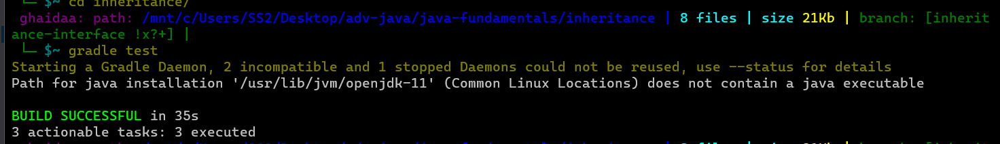

# Overview

These classes are part of an inheritance-based Java program for managing reviews and information about different types of places like restaurants, shops, and theaters. Here's a brief overview of each class and their relationships:

1. Place Class:

- An abstract class that serves as the base for all place types (restaurants, shops, theaters).
- Contains properties like `name`, `description`, and `stars` (average rating).
- Manage reviews associated with the place.
- Implements the `Reviewable` interface to enforce review-related methods.
- Subclasses are required to provide specific implementations.

2. Restaurant Class:
 
- Inherits from the `Place` class.
- Represents a restaurant and includes an additional property `priceCategory`.
- Provides a constructor to initialize restaurant-specific attributes.
- Overrides the `toString()` method to provide a formatted string representation.

3. Shop Class:

- Inherits from the `Place` class.
- Represents a shop and includes an additional property `numberOfDollarSigns`.
- Provides a constructor to initialize shop-specific attributes.
- Overrides the `toString()` method to provide a formatted string representation.

4. Theater Class:

- Inherits from the `Place` class.
- Represents a theater and includes a property `movies` to store movie names.
- Provides methods to add and remove movies from the theater.
- Provides a constructor to initialize theater-specific attributes.
- Overrides the `toString()` method to provide a formatted string representation.

5. Review Class:

- Represents a review with properties like `body`, `author`, `stars` (rating).
- Can be associated with a `Restaurant`, `Shop`, or `Theater`.
- The constructor ensures valid star ratings (between 0 and 5) and associates the review with the relevant place.
- Provides a method to associate a movie with a theater if applicable.
- Overrides the `toString()` method to provide a formatted string representation including associated place and movie details.

6. Reviewable Interface:

- Defines a common interface for all reviewable entities (restaurants, shops, theaters).
- Enforces methods like adding reviews, getting name, stars, description, and reviews list.
- Ensures consistency across different place types.

### Relationships:

- `Restaurant`, `Shop`, and `Theater` classes inherit from the `Place` class.
- All place types implement the `Reviewable` interface, which enforces a common structure for handling reviews.
- `Review` instances are associated with specific places (`Restaurant`, `Shop`, or `Theater`) using composition. Reviews are added to the respective places' review collections upon creation.
- The `Review` class can also associate a movie with a `Theater` if applicable.
- The `toString()` methods are overridden in each class to provide formatted representations containing specific attributes and related information.

---

# Testing

On your cmd or ubuntu cd to inheritance file then, you can run the tests using `gradlew test` on cmd, or you can use `gradle test` using ubuntu

