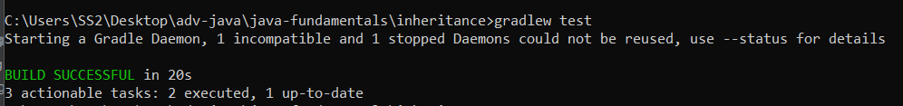

# Overview

The library consists of two main classes:

1. Restaurant: Represents a restaurant with a name, star rating, price category, and associated reviews.

2. Review: Represents a review with a body, author, star rating, and associated restaurant.

The `Restaurant` class has the ability to calculate its average star rating based on associated reviews, while the `Review` class provides information about the review's content and associated restaurant.

### Testing on cmd

